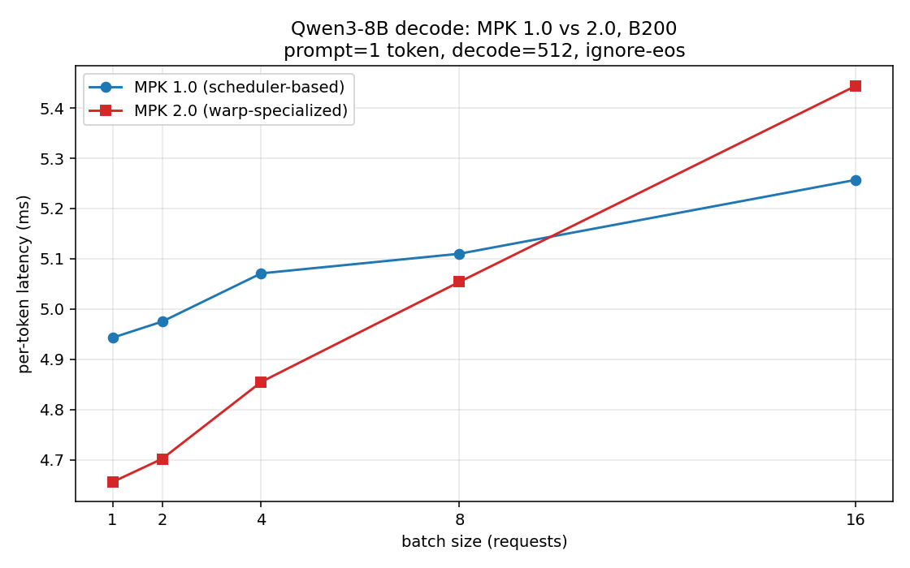

<div align="center">

# Mirage Persistent Kernel: Compiling LLMs into a MegaKernel
    
| [Join Slack](https://join.slack.com/t/miragesystem/shared_invite/zt-37reobr1i-SKjxeYF3GXdPDoCvtVbjTQ) | [Roadmap](https://github.com/mirage-project/mirage/issues/325) | [Blog Post](https://zhihaojia.medium.com/compiling-llms-into-a-megakernel-a-path-to-low-latency-inference-cf7840913c17) | 

</div>

*Latest News* 🔥
* [2026/06] **MPK 2.0 (experimental)**: a new warp-specialized runtime that replaces the dynamic scheduler with a single statically-planned persistent kernel — see [MPK 2.0](#mpk-20-experimental) below.
* [2025/06] We released [Mirage Persistent Kernel (MPK)](https://github.com/mirage-project/mirage/tree/mpk), a compiler and runtime that automatically transforms multi-GPU LLM inference into a high-performance megakernel.

## About

**Mirage Persistent Kernel (MPK)** is a compiler and runtime system that automatically transforms LLM inference into a single megakernel—a fused GPU kernel that performs all necessary computation and communication within a single kernel launch. This end-to-end GPU fusion approach reduces LLM inference latency by 1.2× to 6.7×, all while requiring minimal developer effort.

## Quick Installation

The fastest way to try MPK is to install it directly from source:
```bash
git clone --recursive --branch mpk https://www.github.com/mirage-project/mirage
cd mirage
pip install -e . -v
export MIRAGE_HOME=$(pwd)
```

> 🔧[2025/06/19] We are working on pre-built binary wheels for MPK and will update the installation instructions once they are available.

## Quickstart
Mirage allows you to compile LLMs from the Hugging Face model zoo into a megakernel using just a few dozen lines of Python—mainly to define the kernel’s inputs and outputs. See [this demo script](https://github.com/mirage-project/mirage/blob/mpk/demo/qwen3/demo.py) that compiles the Qwen3-8B model into a megakernel.

We start by running the demo with native Triton and FlashInfer kernels:
```bash
python demo/qwen3/demo.py
```

To compile and execute the megakernel using MPK:
```bash
python demo/qwen3/demo.py --use-mirage
```

To enable profiling (which visualizes the execution timeline of each task):
```bash
python demo/qwen3/demo.py --use-mirage --profiling
```

## MPK 2.0 (Experimental)

MPK 2.0 is a redesign of the runtime around **warp specialization** and
**static planning**. Where MPK 1.0 dedicates some SMs to schedulers that
dispatch tasks to worker SMs at runtime, MPK 2.0 compiles the whole decode
step into a fixed per-SM program executed by a single persistent kernel —
no scheduler SMs, no runtime task queues.

High-level design:

* **Warp-specialized runtime** — each SM runs 8 warps with dedicated roles:
  4 compute (consumer) warps, a loader warp (TMA), a launcher warp
  (tensor-core MMA), a storer warp, and a controller warp that streams task
  descriptors through an on-SM instruction ring.
* **Static per-SM schedule** — the compiler assigns every task of a decode
  step to a specific SM in a specific order; cross-task dependencies are
  still enforced at runtime through lightweight event counters.
* **Paged shared memory** — SMEM is managed as fixed-size pages; a
  compile-time planner packs each task's memory regions onto pages and
  chains page reuse between consecutive tasks on the same SM, laying the
  groundwork for overlapping one task's weight loads with the previous
  task's compute.
* **Channel abstraction** — warp-specialized ops are built from typed
  producer/consumer rings (synchronization separated from storage). On
  Blackwell, the linear op runs as a fully pipelined
  TMA → tcgen05 MMA → epilogue dataflow across the role warps.

Run the demo with the 2.0 runtime by adding `--use-v2`:
```bash
python demo/qwen3/demo.py --use-mirage --use-v2
```

Decode latency vs. MPK 1.0 (Qwen3-8B, B200, 1-token prompt, 512 decode
steps): 2.0 is ahead at small batch sizes; the gap at batch 16 comes from
attention-batch scaling and is being worked on.

<div align="center">

</div>

For a code walkthrough see [docs/mpk/V2_CODEBASE.md](docs/mpk/V2_CODEBASE.md);
status and known limitations are tracked in
[docs/mpk/V2_TODO.md](docs/mpk/V2_TODO.md).

## How MPK Works
Once you've imported the Mirage package, you can instantiate a persistent kernel using the following API:
```python
import mirage as mi
mpk = mi.PersistentKernel(
    world_size=world_size,
    mpi_rank=rank,
    num_workers=96,
    num_local_schedulers=48,
    num_remote_schedulers=0,
    meta_tensors=[step, tokens],
    profiler_tensor=profiler_tensor,
)
```
* `world_size` and `mpi_rank`: number of GPUs and current GPU rank.
* `num_workers`, `num_local_schedulers`, `num_remote_schedulers`: the number of workers, local schedulers, and remote schedulers. They must match the number of physical SMs (`num_workers` + (`num_local_schedulers` + `num_remote_schedulers`) / 4).
* The megakernel currently requires two meta tensors: `step` is an array of integer tracking the current decoding step, and is incremented by MPK after each decoding iteration; `tokens` is a tensor of shape [`num_requests`, `seq_length`] storing prompts and MPK generated tokens.

To attach an existing `PyTorch.Tensor`:
```python
x = mpk.attach_input(torch_tensor=torch_tensor, name="torch_tensor_name")
```
* `name` is used by MPK to refer to the tensor in the generated megakernel in CUDA.

To allocate a new tensor:
```python
y = mpk.new_tensor(
    dims=(batch_size, hidden_size),
    dtype=mi.bfloat16,
    name="embed_out",
    io_category="cuda_tensor",
)
```
* `dims` and `dtype` specify the dimensions and data type of the tensor. 
* `name` is used by MPK to refer to this new tensor in the megakernel. 
* `io_category` indicates how the tensor is allocated and must be `cuda_tensor` or `nvshmem_tensor` (the latter is required for remote GPU access, e.g., during all-reduce).

### Defining the Computation Graph
You can compose the LLM’s computation graph by chaining fused operations. For example: `rmsnorm_linear_layer` fuses an RMSNorm layer and a Linear layer in the megakernel.
```python
mpk.rmsnorm_linear_layer(
    input=x,
    weight_norm=w_norm,
    weight_linear=w_qkv,
    output=attn_in,
    grid_dim=(96, 1, 1),
    block_dim=(128, 1, 1),
)
```
* `weight_norm` and `weight_linear` are the weight tensors for RMSNorm and Linear.
* `input` and `output` are the input and output tensors of this fused layer. 
* `grid_dim` and `block_dim` specifies the number of thread blocks (i.e., number of tasks in the task graph) and number of thread within each thread block. To minimize latency, it is suggested that the total number of thread blocks is a multiplier of the number of workers to avoid outliers.

### Compilation & Execution
Once the computation graph is defined, compile it with:
```python
mpk.compile()
```
Then, run the optimized megakernel as:
```python
mpk()
```

## Contribution
We welcome feedback, contributions, and collaborations from the community! Please join our [Slack channel](https://join.slack.com/t/mirage-ag11870/shared_invite/zt-37reobr1i-SKjxeYF3GXdPDoCvtVbjTQ).

Please let us know if you encounter any bugs or have any suggestions by [submitting an issue](https://github.com/mirage-project/mirage/issues).

## Citation
A paper describing Mirage's techniques is available [on arxiv](https://arxiv.org/abs/2405.05751). Please cite Mirage as:

``` bibtex
@inproceedings {wu2024mirage,
title={Mirage: A Multi-Level Superoptimizer for Tensor Programs}, 
author={Mengdi Wu and Xinhao Cheng and Shengyu Liu and Chunan Shi and Jianan Ji and Kit Ao and Praveen Velliengiri and Xupeng Miao and Oded Padon and Zhihao Jia},
booktitle = {19th USENIX Symposium on Operating Systems Design and Implementation (OSDI 25)},
year = {2025},
address = {Boston, MA},
publisher = {USENIX Association},
month = jul
}

@misc{cheng2025mpk,
      title={Mirage Persistent Kernel: A Compiler and Runtime for Mega-Kernelizing Tensor Programs}, 
      author={Xinhao Cheng and Zhihao Zhang and Yu Zhou and Jianan Ji and Jinchen Jiang and Zepeng Zhao and Ziruo Xiao and Zihao Ye and Yingyi Huang and Ruihang Lai and Hongyi Jin and Bohan Hou and Mengdi Wu and Yixin Dong and Anthony Yip and Zihao Ye and Songting Wang and Wenqin Yang and Xupeng Miao and Tianqi Chen and Zhihao Jia},
      year={2025},
      eprint={2512.22219},
      archivePrefix={arXiv},
      primaryClass={cs.DC},
      url={https://arxiv.org/abs/2512.22219}, 
}
```

## Publications

- **Mirage Persistent Kernel: A Compiler and Runtime for Mega-Kernelizing Tensor Programs**. *Arxiv 2025*. [[arXiv]](https://arxiv.org/abs/2512.22219)
- **Mirage: A Multi-Level Superoptimizer for Tensor Programs**. *OSDI 2025*. [[PDF]](https://www.usenix.org/system/files/osdi25-wu-mengdi.pdf)
- **Identity Testing for Circuits with Exponentiation Gates**. *ITCS 2026* [[arXiv]](https://arxiv.org/pdf/2506.04529)

## License
Mirage uses Apache License 2.0.
