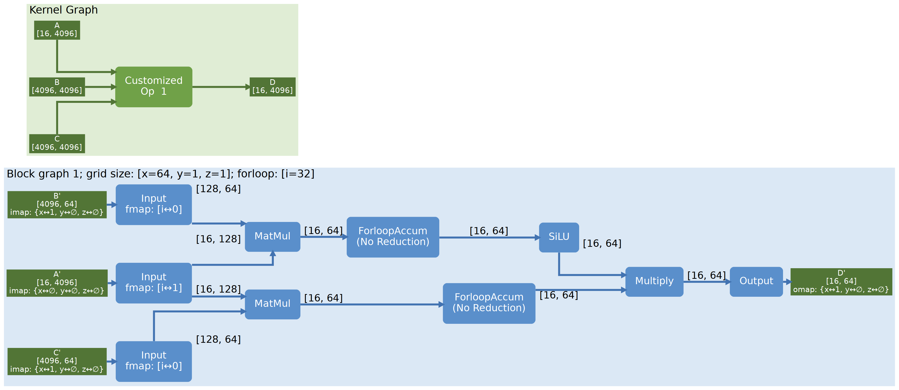

Visualizer: Know Your μGraph in an Intuitive Way
================================================

Overview
--------

The visualizer is designed to render and visualize μGraph, the
multi-level hierarchical graph representation used in Mirage to specify
GPU tensor program execution. It leverages ``graphviz`` to visualize
these representations, producing ``.dot`` and ``.png`` files that
illustrate the hierarchy of operations at the kernel and block levels in
GPU tensor computations.

Visualizer provides a modular way to retrieve data needed and interpret
tensor programs visually, allowing users to observe interconnections and
the flow of tensors between different operation nodes, aiding in
debugging, optimization, and understanding purposes.

Usage
-----

There are two ways to use visualizer:

1. **Using JSON files**: Visualizer can construct a graph by reading a
   JSON file formatted specifically to represent μGraph data. This JSON
   file should contain information on the hierarchical structure of the
   tensor operations, specifying nodes, tensors, and interconnections
   across kernel and block levels. The JSON format is shown in the
   appendix part.

2. **[Recommended] Direct Integration in Mirage:** The Mirage Python
   interface has integrated the visualizer, allowing seamless
   visualization without external JSON files. Users can simply call
   ``graph.visualize("filename")`` to produce ``.dot`` and ``.png``
   outputs directly.

Usage Example
-------------

After building mirage, you can try visualizer by running
``python3 demo/reference_mugraphs/lora.py`` or
``python3 demo/reference_mugraphs/gated_mlp.py``. Take the latter one as
an example, related codes are:

.. code:: python

       # Make a new graph
       graph = mi.new_kernel_graph() 

       # Building the structure of the graph
       X = graph.new_input(dims=(16, 4096), dtype=mi.float16)
       W1 = graph.new_input(dims=(4096, 4096), dtype=mi.float16)
       # ... More building procedure

       # Generate .png and .dot visualized files
       graph.visualize("gated_mlp")

Then a ``.png`` file and a ``.dot`` file will be generated
automatically. The graph ``gated_mlp.png`` is used as an example in the
next section.

Layout of the Generated Graph
-----------------------------

The image generated by the visualizer has a specific layout and style to
represent the structure of a μGraph. Here’s an in-depth breakdown of the
style and elements in the visualization: 

The green background section represents the Kernel Graph layer. Rounded
rectangles in this section are operator nodes, and each contains the
name of the operator. Each customized operator node (named
``Customized Op x``) in the kernel graph corresponds to a Block Graph
displayed in the blue section and has a title “``Block graph x``” where
x displays the correspondence.

The edges connecting these nodes represent tensors, with each tensor’s
shape labeled on the edge (e.g., [16, 4096]). Square nodes are used for
input and output tensors of the Customized Op. These nodes are uniquely
labeled, and their names are referenced in the corresponding block
graph. Input and output tensors are marked with a prime symbol (e.g.,
B’) to show that they are derived from the tensors in the kernel graph
and are referenced within the block graph for more detailed operations.

Additionally, each input tensor node in the block graph displays imap
mappings, indicating how data is partitioned across grid dimensions,
while each output tensor node displays omap mappings, indicating how
output tensors are aggregated along the grid dimensions. Each input node
has an fmap property, indicating the mapping of for-loop dimensions for
accessing tensor elements across multiple iterations. At the top of the
block graph, information about the grid size and for-loop size is
specified.

Dependencies
------------

``graphviz`` library is required to generate and render ``.dot`` and
``.png`` files.

Appendix: JSON File Format
==========================

.. code:: json

   [
       ...,
       [ // One kernel graph
           { // An ordinary operator
               "input_tensors": [
                   {
                       "dim": [
                           2,
                           256,
                           64,
                           0
                       ],
                       "guid": 10000008,
                       "num_dims": 3
                   },
                   {...} //Other tensors
               ],
               "op_type": "kn_input_op",
               "output_tensors": [{...},...]
           },
           { // A customized operator
               "bgraph": { // "bgraph" contains information for the related block graph
                   "block_dim": {
                       "x": 128,
                       "y": 1,
                       "z": 1
                   },
                   "forloop_range": 4,
                   "grid_dim": {
                       "x": 2,
                       "y": 16,
                       "z": 4
                   },
                   "operators": [ 
                       {
                           "dtensor": { // input and output tensor contain "dtensor" to display the original tensor in tensor graph
                               "guid": 10000008,
                           },
                           "forloop_dim": -1,
                           "input_map": {
                               "x": 0,
                               "y": -1,
                               "z": 1
                           },
                           "input_tensors": [],
                           "op_type": "tb_input_op",
                           "output_tensors": [{...}]
                       },
                       {...},... // Other operators
                   ]
               },
               "input_tensors": [{...}...],
               "op_type": "kn_customized_op",
               "output_tensors": [{...}...]
           }
       ],
       [...], //Other graphs
   ]

